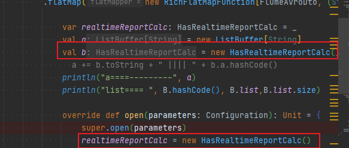

title: 算子Function实例化的坑
---

## 问题回顾

关于一段代码：

```scala
object MySingleObj{
	// 陷阱：
	// 单例对象中一个是可变引用，一个是可变数组
	var str:String = _
	val list = new ListBuffer[String]
}
```

```scala
...
dataStream
	.map(new RichMapFunction(){
		// 问题1：obj1 和 obj2 的实例方式有什么区别。
		// 问题2：考虑参数0的作用以及是否会得到预期效果。
		
		val obj1:MyClass = new MyClass(参数0)
		var obj2:MyClass = _
		
		override def open(paramation:Configuration):Unit = {
			obj2 = new MyClass(参数0)
		}
		
		override def map(value, ....) = {
			// 问题3：如果在这里使用 obj1 和 obj2 会有什么区别。
			
			// 问题4：单个slot中对单例对象中的变量修改，造成的影响是。
			MySingleObj.str = value
			MySingleObj.list += value
		}
	})
...
```
---
## 探究

主要讨论问题1，2。open方法内外实例对象的区别。

如下图， 我们在open中和open外分别new了一个对象。开4并行度，本地执行，模拟4个slot。



通过HSDB查看

一共9个实例，其中4个slot每个2个实例，再加一个client的实例。


而且内存地址都不相同。


这个就说明在open外实例，对于每个slot也是不同地址的对象。

---

简单来说就是：如果在类内open外实例，那么构造过程只会在client执行一次，之后的slot中的对象都相当于是这个实例的克隆。
这样做和open内实例区别就是：实例的构造方法是否被执行。

比如说我们需要根据不同的slot传入不同构造参数，那么使用前者（即open外实例）就不合适了，因为每个slot得到的实例对象的初始状态都是相同的。

## 提醒

1. Flink 算子Function对象的初始化有2个地方，一个是在Clinet端的构造函数中。另一个就是在每个Slot中的**open**方法中。而对于Flink来说任务初始化的时候会调用算子的**open**方法。所以一些初始逻辑一定要记得写在**open**方法中。

2. 因为Flink的slot是多线程执行，所以一定要注意全局静态变量的问题。比如Scala的单例对象或者Java中的静态变量，一定要十分谨慎的在算子中修改其值，最好不要有类似操作。
